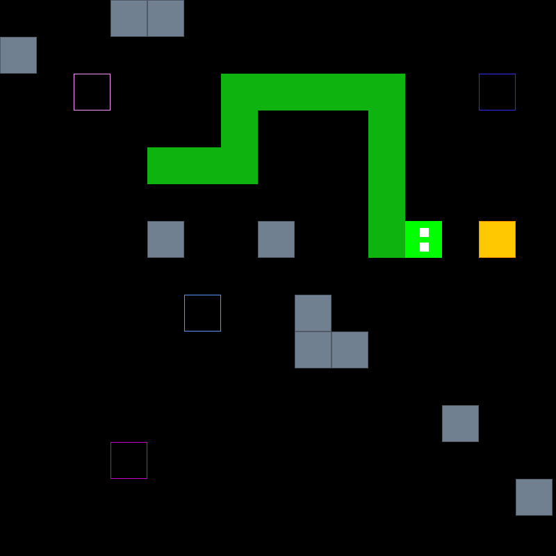

# Snake++
Development of the game "Snake" featuring portals, custom maps and sound effects.  
Cross-platform compatibility using CMake, C, C++ and SDL2.  
A project for the Software Engineering course as part of our studies.

## Preview



# Installation
For Windows 64-Bit a pre-compiled release, that also includes the required .dll files and assets is available:
- Download the zip file from [Releases](https://github.com/Jonny999999/snake-pp/releases/latest) (e.g. "Snake-1.0-win64.zip")
- Extract zip file
- Navigate to the folder and run `Snake.exe`
On other Systems you currently have to compile from source (see next sections)


# Compilation

## Linux
**Install tools and SDL2**
```bash
pacman -S sdl2 sdl2_ttf
pacman -S cmake gcc
```
**Build**
```bash
mkdir build
cd build
cmake ..
make
```

## Windows
**Download SDL**
- Download  `SDL2-devel-2.28.5-VC.zip` from [github/libsdl-org](https://github.com/libsdl-org/SDL/releases/download/release-2.28.5/SDL2-devel-2.28.5-VC.zip)
- Unzip the file and rename the folder to `SDL2` (avoid unnecessary subfolder)
- Place it in the root folder of this repository.  

**Download SDL_ttf**
- Download  `SDL2_ttf-devel-2.20.2-VC.zip` from [github/libsdl-org](https://github.com/libsdl-org/SDL_ttf/releases/download/release-2.20.2/SDL2_ttf-devel-2.20.2-VC.zip)
- Unzip the file and rename the folder to `SDL2_ttf` (avoid unnecessary subfolder)
- Place it in the root folder of this repository.  


**Install compiler** (if not available already)  
- download mingw:
    - visit https://altushost-swe.dl.sourceforge.net/project/mingw-w64/
    and download `x86_64-8.1.0-release-posix-seh-rt.7z`
- Extract the contents to `C:\MinGW`
- Add the path of `MinGW/bin` folder to system environment variable `PATH` (so CMake finds it as 'Kit'):
    - Open 'Control Panel' -> 'Edit the system environment variables' -> 'PATH' -> Add entry `C:\MinGW\bin` 
 
**Install CMake**
- Download and install CMake from https://cmake.org/  

**Compile**  
See VS Code section


# VS Code instructions
## Required extensions
- [Cmake](https://open-vsx.org/extension/twxs/cmake)
- [CmakeTools](https://open-vsx.org/extension/ms-vscode/cmake-tools)
- [C/C++](https://marketplace.visualstudio.com/items?itemName=ms-vscode.cpptools)

## Setup
- With CmakeTools installed open the project folder in VS Code
- open cmd-prompt with `CTRL + SHIFT + P` run `cmake.build`
    - select kit (gcc or installed minGW compiler)  
Alternatively use cmake related buttons in bottom toolbar (CMake: Kit, Build, [all]...)

## Compile
- Use buttons in bottom toolbar (CMake: ... Build [BUG-BUTTON] [PLAY-BUTTON] ... )  
You can also use:
- `ctrl-F5` run without debugger
- `shift-F5` run with debugger
- NOTE: Pressing `F5` only, currently does not work with CMake in VS-Code?
